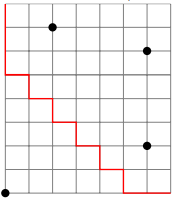

# Proper Social Distancing
In light of recent experiences we’ve all become a bit more aware of social distancing,
and have changed our default behaviours to encourage it. For instance, a pedestrian
wishes to walk from the northwest corner of a large gridded network of walkways to
the southeast corner. There are people seated at benches at some of the intersection
points. To show proper social responsibility, the pedestrian wants to keep as far away
from the other people as they can. That is, they aim to find a path whose minimum
distance from a seated person is as large as possible (the distance between two points
in the grid is the sum of their horizontal and vertical separations).
In a further (and possibly over the top) fit of conscientiousness, they also want to ensure
that, subject to meeting the first criterion, the total distance between the path and the
seated people (i.e., the sum of the minimum distances to each seated person) should be
as large as possible.
## Example
In the grid below seated people are marked with dots, and a (not necessarily unique)
best path is drawn in red. This is justified as follows – clearly the upper left sitter and
lower right sitter mean the best minimum distance is 2 (and that distance is forced for
those two points). The maximum distance we could have for the upper right sitter is 6
since we have to cross their horizontal line somewhere. The first two steps are forced,
so the best possible for the lower left sitter is also 6 - but the third step must reduce
the distance to either the upper right or lower left by 1. Choosing a down step, the
pedestrian can then succeed in keeping their distance from those two points by the zig
zag pattern. This results in a total distance of 15 (2 + 6 + 5 + 2).

## Task
Write a program to find the optimum minimum distance, and also the optimum total
distance for that minimum in a sequence of scenarios contained in an input file read in
from stdin.

## Input Format
Each scenario begins with a line containing the number of horizontal walkways
and the number of vertical walkways.
- Each additional line of a scenario describes the locations of the seated people in
row-column order (with the upper left at 0 0), increasing from top to bottom and
from left to right.
- Each scenario is separated from the next by a blank line.
You may assume that there are at most 100 vertical and 100 horizontal walkways, and
at most 500 seated people in a scenario.
The scenario corresponding to the example above would be:
> 9 8
> 8 0
> 1 2
> 2 6
> 6 6

## Output Format
For each scenario print (to stdout) a line of the following form:
> min M, total T
where M and T are the largest possible minimum distance achievable and the largest
possible total distance achievable for the minimum. So, the output for the scenario
above should be
> min 2, total 15

## Standards
For an achieved standard, the program must work correctly on valid input representing
walkways of size 30 or less, and at most 20 seated people.
Merit criteria include the ability to handle much larger walkways and seated people
efficiently and clearly written code.
Excellence criteria include some significant extension to the functionality of the program, or an investigation of general properties of the problem.

## Objectives
1.1, 1.2, 1.3, 1.4, 2.1, 2.2, 2.4, 26., 2.7, 2.10, 3.3, 3.4, 3.5, 3.6, 4.1, 4.2, 4.3.
(Group)